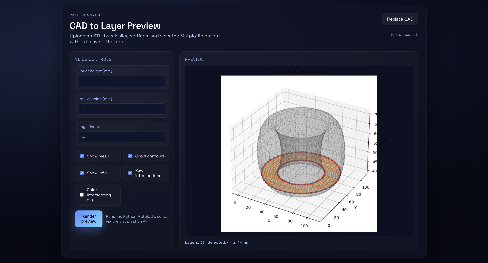

Quick start:
```
mkdir build
cd build
cmake ..
make controller pathplan_bindings
./controller
```
Controller stays alive until it receives a shutdown command (or Ctrl+C).
By default it auto-launches the React UI (port 3000) and Flask viz API (port 8000); set `AUTO_START_FRONTENDS=0` to skip. Logs: `/tmp/ui.log` and `/tmp/visualization-server.log`. The viz API needs `pathplan_bindings` built (`make pathplan_bindings`).

Python virtualenv for viz (recommended to avoid Homebrew pip guard):
```
python3 -m venv .venv
source .venv/bin/activate
python3 -m pip install -r visualization/requirements.txt
```
Then run the API with `python3 visualization/server.py --module-path build --port 8000` or let the controller auto-launch it.
Shutdown: the React button calls the viz API, which sends a shutdown signal to the controller. The controller will stop itself and SIGTERM the auto-started UI/API PIDs recorded in `/tmp/ui.pid` and `/tmp/visualization-server.pid`.

Visualization workflow:
- API: `python3 visualization/server.py --module-path build --port 8000` (requires `make pathplan_bindings`)
- Client: `cd client && npm start` (set `REACT_APP_VIZ_URL` if API is not localhost:8000/visualize)
- In the app: import STL → adjust slice controls → Render preview to see the embedded Matplotlib image.

Headless preview (CLI):
```
python visualization/visualize_path.py tests/data/torus_ascii.stl --layer-height 1 --layer 7 --show-mesh --show-contours --module-path build
```



# Goal
Create a self-sustaining, multi-end effector system with different modes of actuation for managing a garden

# Motion
## completed
- start motor from Arduino script that interfaces with RAMPS board
- create custom base kernel to Raspberry Pi for RTOS
- communicate over UART to Pi
- write visual output via frame buffer and mailbox
- send signals from Pi => Arduino => RAMPS board for motor control
- build frame of Core XY 3D printer


## todo
- solder level shifter module to Pi so that it can write outputs to RAMPS directly
    - this enables real-time communication instead of hop through Arduino
- kernel refactor to work with controller and vice versa


# Planning
## completed
- vector and triangle primitives
- stl parser for ascii and binary
- compute line segments of intersecting mesh triangles with each layer
- matplotlib-based pybinded visualization tool
- contouring to turn each layer into path
- basic clipped infill

## todo
- hexagon infill
- gyroid infill
- various kinds of nonplanar slicing
- various kinds of support/build plate optimization
- metrics + experiments planning


# Sensing
## todo
- start with cameras probably
