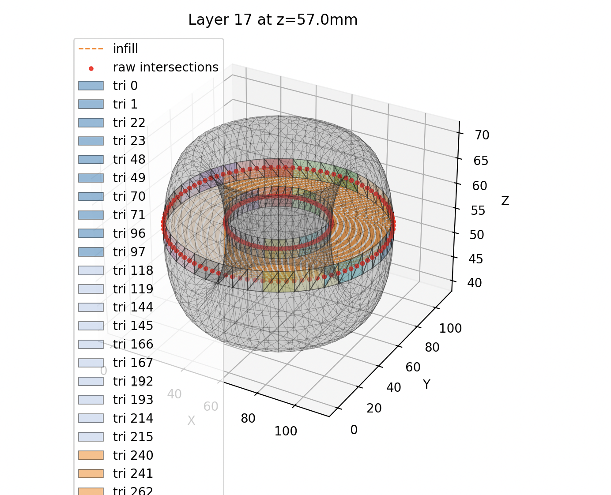

Build instructions:
```
mkdir build
cd build
cmake ..
make
ctest // If you want to run unit tests
```

For path visualization:
```
python visualization/visualize_path.py tests/data/torus_ascii.stl \
  --layer-height 1 --layer 7 --show-mesh --show-raw-intersections \
  --show-contours --color-intersecting-tris --list-intersecting-tris \
  --module-path build
```



# Goal
Create a self-sustaining, multi-end effector system with different modes of actuation for managing a garden

# Motion
## completed
- start motor from Arduino script that interfaces with RAMPS board
- create custom base kernel to Raspberry Pi for RTOS
- communicate over UART to Pi
- write visual output via frame buffer and mailbox
- send signals from Pi => Arduino => RAMPS board for motor control
- build frame of Core XY 3D printer


## todo
- solder level shifter module to Pi so that it can write outputs to RAMPS directly
    - this enables real-time communication instead of hop through Arduino
- kernel refactor to work with controller and vice versa


# Planning
## completed
- vector and triangle primitives
- stl parser for ascii and binary
- compute line segments of intersecting mesh triangles with each layer
- matplotlib-based pybinded visualization tool
- contouring to turn each layer into path
- basic clipped infill

## todo
- hexagon infill
- gyroid infill
- various kinds of nonplanar slicing
- various kinds of support/build plate optimization
- metrics + experiments planning


# Sensing
## todo
- start with cameras probably
